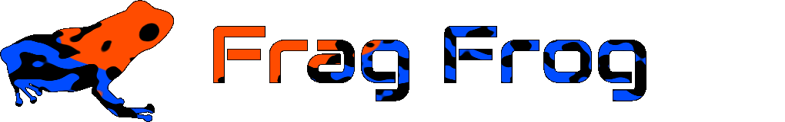
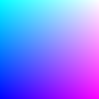
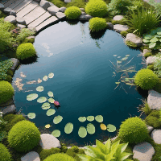

<p align="center">
  
<p>

> Run WebGL fragment shaders without the boilerplate code - Shadertoy-ish.

**Key features:**

- Apply fragment shaders to a canvas with minimal code.
- Compatible with GLES 2.0 and 3.0.
- Straightforward creation of multi-pass shaders.
- Supports rendering to framebuffers and multiple textures.


**While being:**

- Tiny (~3.5KB minified+gzipped; no dependencies).
- Tested (100% coverage*).
- Fully typed.

**TOC**

- [Tutorial](#tutorial)
  - [Hello world](#hello-world)
  - [Assigning uniforms and varyings](#assigning-uniforms-and-varyings)
  - [Data types](#data-types)
    - [Wrappers](#wrappers)
    - [Convenience functions](#convenience-functions)
    - [Fallback for unsupported data types](#fallback-for-unsupported-data-types)
  - [Texture parameters](#texture-parameters)
  - [Multi-pass shaders](#multi-pass-shaders)
    - [Doublebuffer](#doublebuffer)
    - [Framebuffer](#framebuffer)
  - [Advanced features](#advanced-features)
    - [GLES 3.0 and multiple render targets](#gles-30-and-multiple-render-targets)
    - [Floating-point textures](#floating-point-textures)
- [Footnotes](#footnotes)

# Tutorial

## Hello world

Let's draw this:
<p align="center">
  
<p>


```ts
// A Frag Frog context is created from an existing canvas.
const outCanvas = document.getElementById('out-canvas') as HTMLCanvasElement;
const context = fragFrog(outCanvas);

// Create the shader.
const shader = context.createShader(`
  precision mediump float;
  void main(void) {
    gl_FragColor = vec4(gl_FragCoord.xy / vec2(200.0), 1.0, 1.0);
  }
`);

// Run the shader.
// Drawing to `context.out` will render to the canvas from which the context was created.
shader.draw(context.out);
```

As this shader has no `varying`s and no `uniform`s, we're done.

## Assigning uniforms and varyings

The following code snippet demonstrates how uniforms and varyings are assigned using a basic ripple shader as an example.


<p align="center">
  
<p>

```ts
const src = `
  precision mediump float;

  varying vec2 v_tpos;
  
  uniform float u_strength;
  uniform sampler2D u_texture;
  uniform float u_time;

  void main(void) {
    vec2 diff = v_tpos - vec2(0.5);
    float offset = length(diff);
    float deviation =
        sin(offset * 30.0 - u_time * 3.5) *
        pow((1.0 - offset), 2.0);
        
    gl_FragColor = texture2D(
      u_texture,
      v_tpos + deviation * u_strength * normalize(diff)
    );
  }
`;

const shader = context.createShader(src, {
  // Varyings are defined together with the shader.
  varyings: {
    // This means, `v_tpos` will be the fragment's 2D coordinate in (0, 1). (***)
    v_tpos: context.v.UV()
  },
});

// Uniforms are passed when making the draw call.
shader.draw(context.out, {
  // Assign a float to `u_strength`.
  u_strength: context.u.float(0.03),
  // Assigning a texture is as simple as assigning a float.
  // `context.u.sampler2D` accepts optional texture filtering settings.
  u_texture: context.u.sampler2D(inCanvas);
  // For convenience, there are a some predefined values for common use cases.
  // This one is the time since the creation of the context in seconds.
  u_time: context.u.time(),
});
```

## Data types

### Wrappers

`context.u` has built-in wrappers for common GLSL data types:
- `bool(value: boolean)`
- `int(value: number)`
- `float(value: number)`
- `vec2(x: number, y: number)`
- `vec3(r: number, g: number, b: number)`
- `vec4(r: number, g: number, b: number, a: number)`
- `sampler2D(image, params?)`, where `image` can be any `TexImageSource` (`ImageBitmap, ImageData, HTMLImageElement, HTMLCanvasElement, HTMLVideoElement, OffscreenCanvas, VideoFrame`) and [frame-/doublebuffers](#multi-pass-shaders).

### Convenience functions

On top, there are some functions for quick access to common shader utilities.

<table>
  <tbody>
    <tr>
      <th align="center">Function</th>
      <th align="center">GLSL Data Type</th>
      <th align="center">Description</th>
    </tr>
    <tr>
      <td>
        <code>resolution()</code>
      </td>
      <td>
        <code>vec2</code>
      </td>
      <td>
        Will evaluate to the width and height of the active render target in pixels.
      </td>
    </tr>
    <tr>
      <td>
        <code>pixel()</code>
      </td>
      <td>
        <code>vec2</code>
      </td>
      <td>
        The width and the height of a pixel in texture space of the render target.
      </td>
    </tr>
    <tr>
      <td>
        <code>halfpixel()</code>
      </td>
      <td>
        <code>vec2</code>
      </td>
      <td>
        Half the width and the height of a pixel in texture space.
      </td>
    </tr>
    <tr>
      <td>
        <code>time()</code>
      </td>
      <td>
        <code>float</code>
      </td>
      <td>
        Time since the creation of the context in seconds. As these values are much closer to 0 than e.g. <code>Date.now() / 1000</code>, the calculations in the shader will be more numerically stable.
      </td>
    </tr>
    <tr>
      <td>
        <code>delta()</code>
      </td>
      <td>
        <code>float</code>
      </td>
      <td>
        Time since the last draw call in seconds. Will evaluate to 1/60 on the first draw call.
      </td>
    </tr>
  </tbody>
</table>

### Fallback for unsupported data types

If there is no wrapper for the data type of your shader variable, you can use `context.u.uniform` as a fallback. You can do arbitrary WebGL API calls in its delegate function:

```ts
shader.draw(context.out, {
  u_mat: context.u.uniform((gl, location) => {
    gl.uniformMatrix2fv(location, false, [2, 1, 2, 2]);
  }),
});
```

## Texture parameters

`context.u.sampler2D(value, params?)` takes an optional second parameter for defining texture parameters. It has the shape:

```ts
export interface ITextureParameters {
  /**
   * The same value is applied to the MIN and MAX filter.
   */
  filter?: 'linear' | 'nearest';
  /**
   * The same value is applied to horizontal and vertical wrap.
   */
  wrap?: 'repeat' | 'clampToEdge' | 'mirroredRepeat';
}
```

It defaults to `{ filter: 'linear', wrap: 'mirroredRepeat' }` (in most scenarios**).

If you want more control over the texture parameters, you can also pass a delegate function:

```ts
shader.draw(context.out, {
  u_texture: context.u.sampler2D(inCanvas, (gl) => {
    gl.texParameteri(gl.TEXTURE_2D, gl.TEXTURE_WRAP_S, gl.REPEAT);
    gl.texParameteri(gl.TEXTURE_2D, gl.TEXTURE_WRAP_T, gl.CLAMP_TO_EDGE);
  }),
});
```


## Multi-pass shaders

Writing multi-pass shaders can be challenging with WebGL. In Frag Frog, there is a simple wrapper for framebuffers and a doublebuffer implementation. To flatten the learning curve, Frag Frog purposely refrains from any graph model/DSL/declarative syntax for composing shaders. You just do it programmatically.

### Doublebuffer

You can think of a doublebuffer as a buffer on which you can read and write at the same time (which is normally not possible in WebGL). They are useful for shaders that simply require the same pass to be executed many times.

Consider this incredibly minimal blur shader:

```ts
const src = `
  precision mediump float;

  varying vec2 v_tpos;

  uniform vec2 u_halfpixel;
  uniform sampler2D u_texture;

  void main(void) {
    // It works by using the linear sampling hardware
    gl_FragColor = texture2D(u_texture, v_tpos + u_halfpixel);
  }
`;

const shader = context.createShader(src, {
  varyings: { v_tpos: context.v.UV() },
});

// Create a doublebuffer.
const buffer = context.createDoublebuffer();
// Set the initial value (required, unless you manually drew to the buffer before).
buffer.seed(inCanvas);

// Iterate, drawing the buffer onto itself each time.
for (let i = 0; i < 10; i++) {
  shader.draw(buffer, {
    u_halfpixel: context.u.halfpixel(),
    u_texture: context.u.sampler2D(buffer),
});

// Finally, show the result on the output canvas.
buffer.flush();
```

### Framebuffer

Framebuffers are general off-screen render targets to which you can draw intermediate results. The following example implements a two-pass Gaussian blur shader, but this time I omitted the exact shader code for brevity.

```ts
// Create a framebuffer.
const fb = context.createFramebuffer();

// Draw the horizontal blur pass onto the framebuffer with the source image as an input.
shader.draw(fb, {
  u_dir: context.u.vec2(1, 0),
  u_texture: context.u.sampler2D(sourceCanvas),
});

// Draw the vertical blur pass onto the output canvas using the previous framebuffer as an input.
shader.draw(context.out, {
  u_dir: context.u.vec2(0, 1),
  u_texture: context.u.sampler2D(fb),
});
```

Framebuffers are not only more flexible; they can also carry multiple textures (see next section).

## Advanced features

### GLES 3.0 and multiple render targets

With a framebuffer and GLES 3.0 it is possible to write a shader that renders to multiple textures at once in a single pass. Consider this (admittedly not very creative) shader that splits a texture into its RGB components:

```ts
// Rendering to multiple targets is only supported in GLES 3.0.
// The first line of your shader source has to be `#version 300 es`.
const src = `#version 300 es
  precision mediump float;
  
  varying vec2 v_tpos;
  uniform sampler2D u_texture;
  
  // Declare out variables instead of using `gl_FragColor`.
  layout(location = 0) out vec4 out_r;
  layout(location = 1) out vec4 out_g;
  layout(location = 2) out vec4 out_b;
  
  void main(void) {
    vec4 color = texture2D(u_texture, v_tpos);
    out_r = vec4(color.r);
    out_g = vec4(color.g);
    out_b = vec4(color.b);
  }`

const shader = context.createShader(src, {
  varyings: { v_tpos: context.v.UV() },
});

// Create a framebuffer with 3 textures.
const fb = context.createFramebuffer(3);

shader.draw(fb, {
  u_texture: context.u.sampler2D(inCanvas)
});
// For example: render the texture from location 0 (the red channel) to the
// output canvas.
fb.flush(0);
```

You can also use individual textures from a framebuffer in the next render pass:

```ts
shader.draw(context.out, {
  u_texture: context.u.sampler2D(fb.getTexture(0))
});
```

### Floating-point textures

By default, WebGL will cap the components of your fragment shader's output to the interval [0, 1]. For example, if you write a multi-pass shader where in the first pass you output
```ts
gl_FragColor = vec4(-1.0, -2.0, 2.0, 42.0);
```
it will become `[0.0, 0.0, 1.0, 1.0]` in the next shader pass.

To enable uncapped floating point numbers, initialize your framebuffer like so:
```ts
const fb = context.createFramebuffer(1, 1, true);
//                                         ^
```

**This may not work on every hardware!** Likewise, linear sampling on floating point textures is also a WebGL extension that is not guaranteed to work everywhere (**).


# Footnotes

(*) The test suite currently consists fully of end-to-end tests. In the beginning, there is a shader, and at the end, we analyze the pixels in the resulting image. The approach has offered me a high degree of confidence with relatively few test cases, and a lot of flexibility in terms of changing the implementation without breaking the tests. I still think a few actual unit tests would complete the test suite.

(**) If you are drawing to a framebuffer with floating-point textures enabled, but the user's system does not support the `OES_texture_float_linear` extension, the default value of `filter` will fall back to `nearest` instead of `linear`. Always confirm, that `context.floatingPointTexturesSupported` and `context.floatingPointTexturesLinearSamplingSupported` are true, if you intend to use the respective features.

(***) An HTML canvas has its origin at the top left corner and the Y axis points downwards. In WebGL, this is flipped. Frag Frog's varyings `UV` or `XY` work like in a canvas, so you don't have to care about flipped images.
